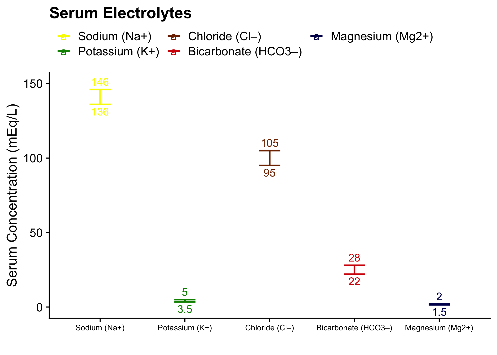
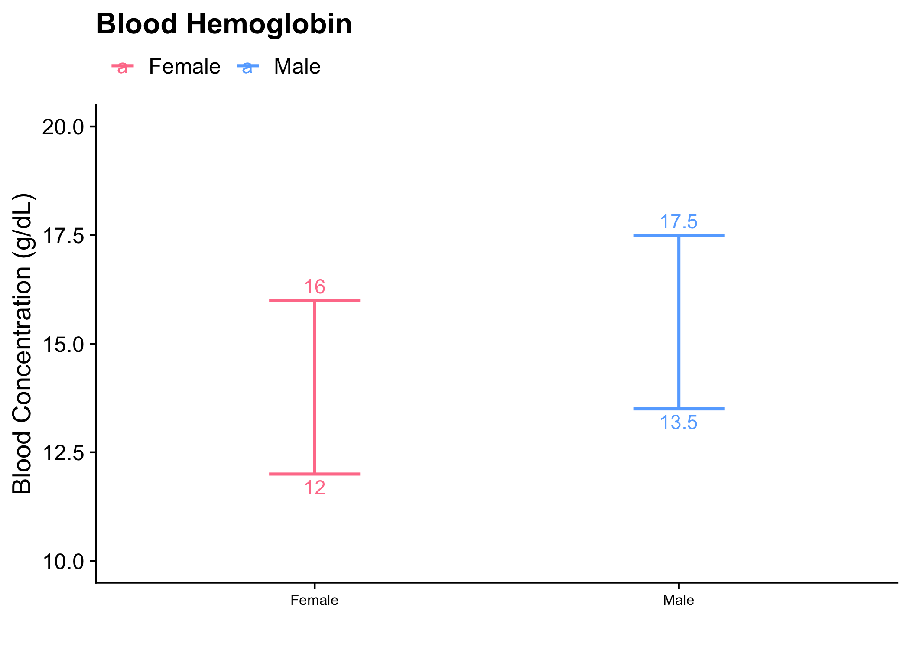
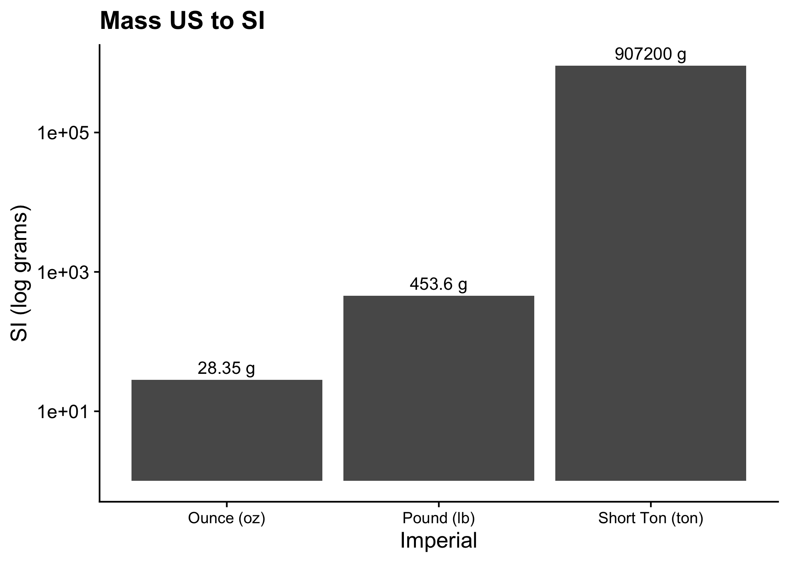
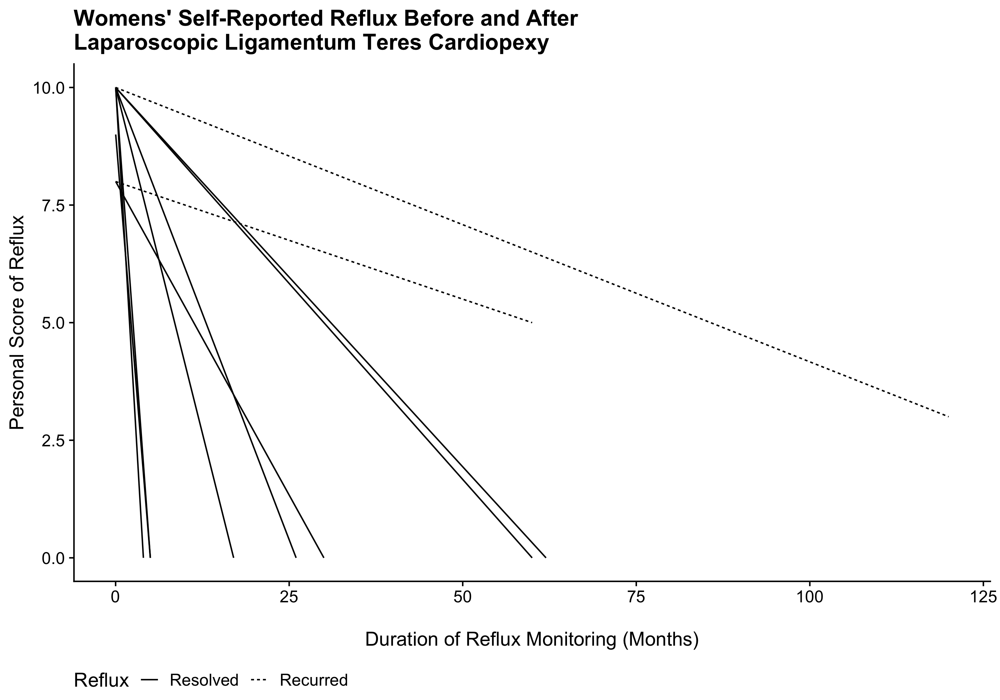

# clinical_bits

Bits of miscellanea from clinical training illustrated graphically.

## Lab Values

Plots are used to illustrate normal lab values.

Common themes are used to facilitate learning. For example, sex-specific values have consistent labeling.

## Unit Conversions

Common conversions used in medicine are illustrated to build rapid intuition.

## Psychiatry Timeline

These data illustrate how time plays into diagnoses in psychiatry.

Data are taken from a [google sheet](https://docs.google.com/spreadsheets/d/1lTrc-vq_fMnXjJaGGOL1pwtFUlwj4M0NWOVYM102MSU/edit?usp=sharing) that compiles diagnostic information.

A blogpost will better explore these ideas.

## General Surgery

Journal club presentation of alleviating severe GERD s/p sleeve gastrectomy using Laparoscopic Ligamentum Teres cardiopexy, a simpler procedure than the Roux-en-Y-Gastric Bypass. [@hawasli_2021_laparoscopic]

