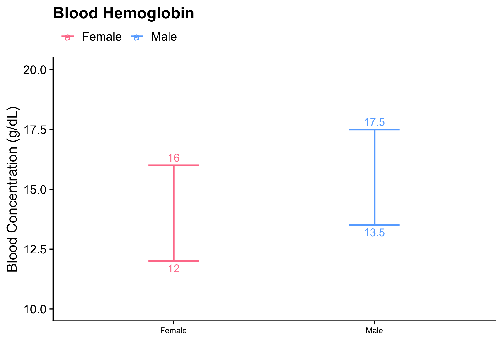
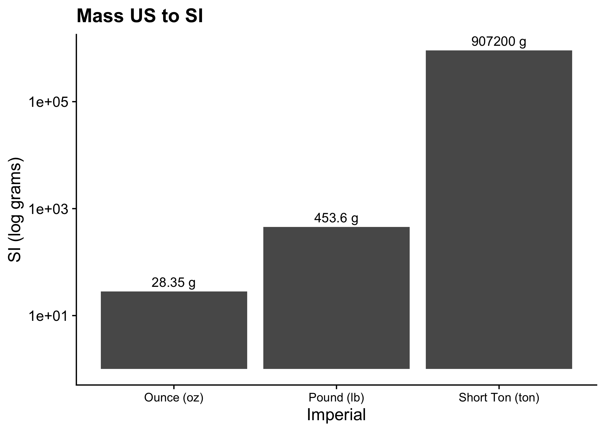

# clinical_bits
Miscellanea from clinical training

## Lab Values

Plots are used to illustrate normal lab values.

Common themes are used to facilitate learning. For example, sex-specific values have consistent labeling.

## Unit Conversions

Common conversions used in medicine are illustrated to build rapid intuition.

